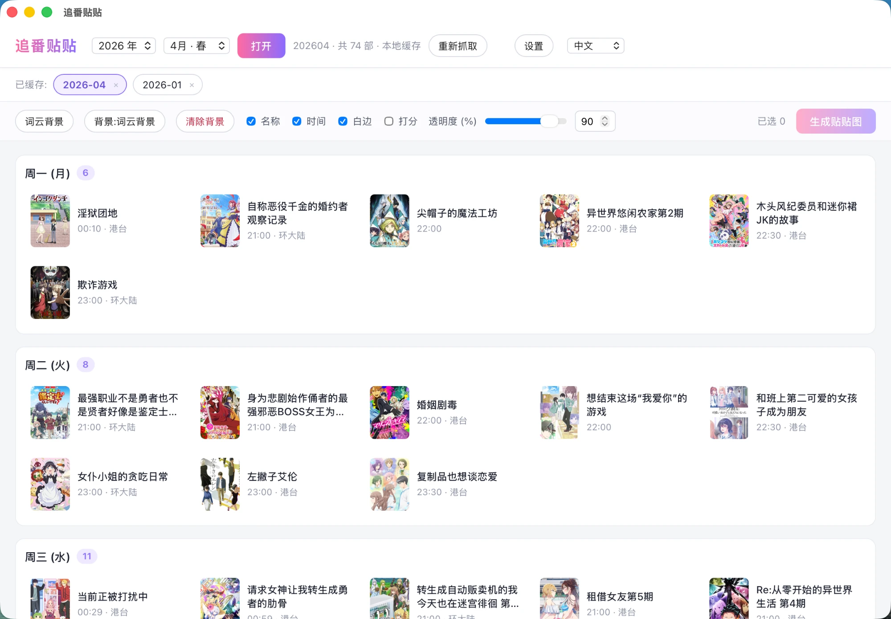
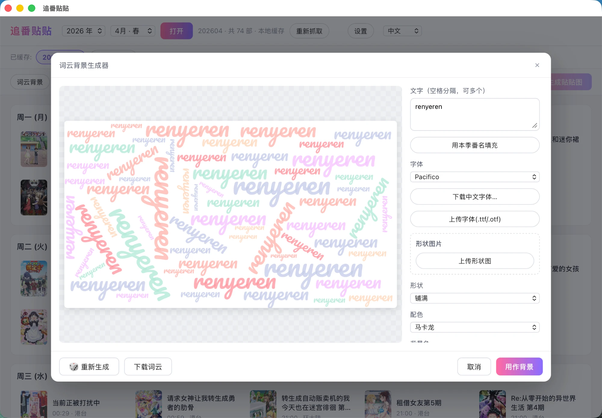
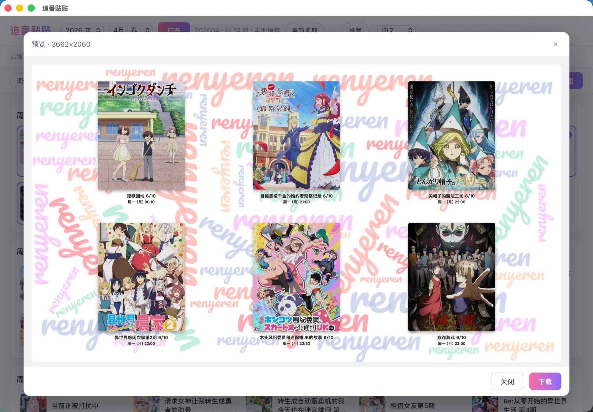

<div align="center">

# 追番贴贴 / AniAni

**跨平台的「季度新番总结贴贴图」生成器** · A cross-platform desktop app for building seasonal-anime collage images

[简体中文](#简体中文) · [English](#english)

</div>

---

<a id="简体中文"></a>

## 简体中文

把一个季度（1/4/7/10 月）的新番表抓下来，挑出在追的番，拼成一张漂亮的「贴贴图」——封面 + 名称 + 时间 +（可选）评分，叠在自定义背景上。内置一个**词云背景生成器**，无需再去 wordart.com。

数据来源：[yuc.wiki](https://yuc.wiki)。本项目是早期 Python 命令行工具 `anime_tietie` 的桌面化重写。

### 截图

> 首次查看请先把 [`docs/screenshots/`](docs/screenshots) 里对应的图片补上（见该目录说明）。

| 主界面（按星期横向排布） | 词云背景生成器 | 生成预览 |
| --- | --- | --- |
|  |  |  |

### 功能

- **按年份 + 季度抓取**：选 `2026 年 / 4月·春` 即自动请求 `https://yuc.wiki/202604/`，无需手填网址。
- **本地缓存归档**：每个季度的页面、封面、背景、勾选记录都缓存在本地；启动自动打开最近一个季度，可在「已缓存」栏切换/删除，离线可用。
- **挑选 + 评分**：点卡片勾选，可给每部番填 0–10 评分。
- **贴贴图合成**（HTML Canvas）：自动按背景比例排版，白色相片边框（可关）、阴影、名称/时间/评分开关、背景透明度。
- **词云背景生成器**：自选文字 / 用本季番名填充；30+ 内置开源英文字体 + 可下载中文字体 + 上传自定义字体；形状、配色、排布、旋转、密度、字号、**字体透明度**；可上传图片做形状蒙版（阈值 + 边缘检测，词语只落在图片的部分区域且不被切断）。
- **自动下载 + 状态提示**：词云背景、贴贴图直接写入设置好的文件夹（无系统对话框），界面显示「保存中 → 成功 / 失败」。
- **多语言**：中文 / English / 日本語（右上角切换）。

### 下载安装

前往 [Releases](https://github.com/muzi-xiaoren/AniAni/releases) 下载对应平台：

| 你的设备 | 下载 |
| --- | --- |
| macOS · Apple Silicon（M 系列） | `*_aarch64.dmg` |
| macOS · Intel | `*_x64.dmg` |
| Windows x64 | `*_x64-setup.exe`（推荐）或 `*_x64_en-US.msi` |

> `*.app.tar.gz` 是自动更新用的包，普通安装请忽略。
> 应用未做代码签名：macOS 首次打开如提示「无法验证/已损坏」，**右键图标 → 打开**；Windows 若有 SmartScreen，点「更多信息 → 仍要运行」。

### 生成的图片保存在哪

- 默认保存目录：`~/追番贴贴`（可在「设置」里改成主目录下任意文件夹）。
- 按类型分文件夹：
  - 词云背景 → `wordcloud/<年月>_wordcloud.png`
  - 不打分贴贴图 → `before/<年月>_before.png`
  - 打分贴贴图 → `after/<年月>_after.png`（勾选工具栏「打分」时）
- 受应用文件访问范围限制，保存目录需在用户主目录（`~`）之下。

### 技术栈

[Tauri 2](https://tauri.app)（Rust 后端，安装包小、启动快）· React 19 + TypeScript + [Vite](https://vite.dev) · HTML Canvas 合成 · [wordcloud2.js](https://github.com/timdream/wordcloud2.js) · [@fontsource](https://fontsource.org) 内置字体 · [i18next](https://www.i18next.com) 多语言。

### 代码结构

```
anime-tietie/
├─ src/                       前端 (React + TS)
│  ├─ App.tsx / App.css       主界面：季度抓取、看板、工具栏、设置/语言入口
│  ├─ main.tsx                入口（挂载 React、引入字体与 i18n）
│  ├─ i18n.ts                 多语言资源 (zh/en/ja) 与切换
│  ├─ fonts.ts                内置开源英文字体 (@fontsource) 导入
│  ├─ components/
│  │  ├─ Cover.tsx            封面缩略图（缓存优先，blob URL）
│  │  ├─ BackgroundStudio.tsx 词云背景生成器（含形状蒙版、字体透明度、下载）
│  │  ├─ FontManager.tsx      中文字体下载/删除管理
│  │  ├─ PreviewModal.tsx     合成结果预览 + 下载
│  │  └─ SettingsModal.tsx    设置（图片保存目录）
│  └─ lib/
│     ├─ types.ts             数据类型 (AnimeEntry / SeasonData …)
│     ├─ parseRules.ts        解析选择器（站点改版时改这里）
│     ├─ parse.ts             解析 yuc.wiki 页面（结构锚定，抗类名漂移）
│     ├─ schedule.ts          排期归一化（>=24:00 顺延、排序、重编号）
│     ├─ fetch.ts             抓页面/封面（Tauri http，绕过 CORS/混合内容）
│     ├─ store.ts             按季度本地缓存（页面/数据/封面/背景/项目）
│     ├─ settings.ts          设置 + 图片导出（before/after/wordcloud）
│     ├─ fontStore.ts         可下载中文字体（jsDelivr → AppData/fonts）
│     ├─ compose.ts           Canvas 贴贴图合成
│     └─ wordcloud.ts         词云渲染（调色板/形状/蒙版/字体透明度）
├─ src-tauri/                 Rust 后端
│  ├─ tauri.conf.json         应用配置（窗口、打包、图标）
│  ├─ capabilities/default.json  权限（http 白名单、fs 范围、mkdir）
│  ├─ src/{main.rs, lib.rs}   Tauri 入口
│  └─ icons/                  应用图标
├─ test/                      离线测试 (tsx)：parse / compose + 页面 fixture
├─ .github/workflows/release.yml  CI：构建 macOS/Windows 安装包并发布 Release
└─ package.json / vite.config.ts / tsconfig*.json
```

### 本地开发

需要 [Node.js](https://nodejs.org)（18+）和 [Rust](https://rustup.rs)。

```bash
npm install          # 安装前端依赖
npm run tauri dev    # 启动桌面应用（开发模式，热更新）
npm run build        # 仅类型检查 + 构建前端 (tsc + vite)
npm run tauri build  # 打本地安装包
npm run test:parse   # 离线解析测试
```

> 改动 `src-tauri/capabilities/*` 等权限文件后，需重启 `npm run tauri dev` 才生效。

### 构建与发布（CI）

`.github/workflows/release.yml` 用 [`tauri-action`](https://github.com/tauri-apps/tauri-action) 在 GitHub Actions 上构建并**自动发布** Release（macOS 拆 Intel/Apple Silicon 两个 `.dmg`，Windows 出 `.msi` + `.exe`）。

发新版本：

```bash
# 1. 同步改版本号：src-tauri/tauri.conf.json、package.json、src-tauri/Cargo.toml
# 2. 提交并推送
git commit -am "Release v1.1.0" && git push
# 3. 打同名 tag 触发构建（Release 标签取自 tauri.conf.json 的 version）
git tag v1.1.0 && git push origin v1.1.0
```

### 字体 / 多语言

- **字体**：内置 30+ 款 OFL 开源英文字体（随包，跨系统渲染一致）；中文字体体积大，做成「可下载/可删除」；也支持上传自己的字体。
- **多语言**：`src/i18n.ts` 内置 zh/en/ja。新增语言：在 `LANGS` 加一项并补一段 `resources`。

### 致谢

- 番剧数据来自 [yuc.wiki](https://yuc.wiki)。
- 词云渲染基于 [wordcloud2.js](https://github.com/timdream/wordcloud2.js)。

---

<a id="english"></a>

## English

Scrape a season's (Jan/Apr/Jul/Oct) new-anime schedule, pick the shows you're watching, and compose a pretty **collage** — covers + titles + air times + (optional) scores over a custom background. A built-in **word-cloud background studio** replaces the manual wordart.com step.

Data source: [yuc.wiki](https://yuc.wiki). This is a desktop rewrite of an earlier Python CLI tool, `anime_tietie`.

### Screenshots

> Add the images under [`docs/screenshots/`](docs/screenshots) first (see the note in that folder).

| Main board (rows per weekday) | Word-cloud studio | Render preview |
| --- | --- | --- |
|  |  |  |

### Features

- **Fetch by year + season** — pick `2026 / Apr·Spring` and it requests `https://yuc.wiki/202604/`; no URL typing.
- **Local cache** — each season's page, covers, background and selections are cached; the most recent season opens on launch; switch/delete in the "Cached" bar; works offline.
- **Pick + score** — click cards to select, give each show a 0–10 score.
- **Collage compositing** (HTML Canvas) — auto-layout to the background's aspect ratio, white photo border (toggle), shadows, name/time/score toggles, background opacity.
- **Word-cloud studio** — custom text or fill with the season's titles; 30+ bundled OSS Latin fonts + downloadable CJK fonts + custom font upload; shape, palette, layout, rotation, density, size and **text opacity**; upload an image as a shape mask (threshold + edge detection — words fill only part of the image and are never clipped mid-glyph).
- **Auto-download + status** — word clouds and collages are written straight to your chosen folder (no OS dialog) with a saving → success/failure status.
- **i18n** — 中文 / English / 日本語 (switch top-right).

### Download & Install

Grab the right file from [Releases](https://github.com/muzi-xiaoren/AniAni/releases):

| Your machine | File |
| --- | --- |
| macOS · Apple Silicon (M-series) | `*_aarch64.dmg` |
| macOS · Intel | `*_x64.dmg` |
| Windows x64 | `*_x64-setup.exe` (recommended) or `*_x64_en-US.msi` |

> `*.app.tar.gz` are auto-updater archives — ignore them for a normal install.
> The app is unsigned: on macOS, if you see "cannot verify / is damaged", **right-click the icon → Open**; on Windows, click "More info → Run anyway" on SmartScreen.

### Where images are saved

- Default folder: `~/追番贴贴` (changeable in **Settings** to any folder under your home directory).
- Split by kind: word clouds → `wordcloud/`, unscored collages → `before/<ym>_before.png`, scored collages → `after/<ym>_after.png` (when the "Scored" toggle is on).
- The folder must live under your home directory (`~`) due to the app's file-access scope.

### Tech stack

[Tauri 2](https://tauri.app) (Rust backend — small, fast) · React 19 + TypeScript + [Vite](https://vite.dev) · HTML Canvas · [wordcloud2.js](https://github.com/timdream/wordcloud2.js) · [@fontsource](https://fontsource.org) · [i18next](https://www.i18next.com).

### Project structure

See the annotated tree in the [简体中文](#代码结构) section above — `src/` is the React frontend (`components/` UI, `lib/` logic), `src-tauri/` is the Rust/Tauri shell, `test/` holds offline tests, and `.github/workflows/release.yml` is the CI release pipeline.

### Development

Requires [Node.js](https://nodejs.org) 18+ and [Rust](https://rustup.rs).

```bash
npm install          # frontend deps
npm run tauri dev    # run the desktop app (dev, hot-reload)
npm run build        # type-check + build frontend (tsc + vite)
npm run tauri build  # build local installers
npm run test:parse   # offline parser test
```

> After editing `src-tauri/capabilities/*` (permissions), restart `npm run tauri dev`.

### Build & Release (CI)

`.github/workflows/release.yml` uses [`tauri-action`](https://github.com/tauri-apps/tauri-action) to build and **auto-publish** a Release (macOS split into Intel/Apple Silicon `.dmg`s; Windows `.msi` + `.exe`). To cut a release: bump the version in `tauri.conf.json` + `package.json` + `Cargo.toml`, commit, then push a matching `vX.Y.Z` tag.

### Credits

Anime data from [yuc.wiki](https://yuc.wiki); word-cloud rendering via [wordcloud2.js](https://github.com/timdream/wordcloud2.js).
